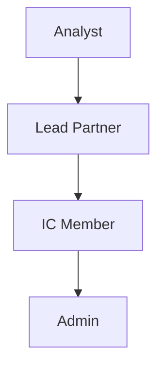

# RBAC & データマスキング詳細仕様書

**Version**: 1.0.0
**Last Updated**: 2025-11-01

## 目次

1. [ロール定義](#1-ロール定義)
2. [権限マトリックス](#2-権限マトリックス)
3. [データマスキングルール](#3-データマスキングルール)
4. [実装仕様](#4-実装仕様)
5. [監査ログ仕様](#5-監査ログ仕様)
6. [テストマトリックス](#6-テストマトリックス)

---

## 1. ロール定義

### 1.1 ロール一覧と責務

| Role | 役職例 | 主な責務 | データアクセス範囲 |
|------|--------|---------|------------------|
| **analyst** | アナリスト、アソシエイト | 案件調査、データ入力、初期分析 | 自分が担当する案件のみ |
| **lead_partner** | シニアアソシエイト、VP | 案件主導、レポート作成、承認 | 全案件のデータ（CONF以外） |
| **ic_member** | パートナー、投資委員会メンバー | 投資判断、最終承認 | 全データ（機密情報含む） |
| **admin** | システム管理者 | ユーザー管理、システム設定 | 全データ + 管理機能 |

### 1.2 ロール階層と昇格パス



昇格時の権限継承：
- 上位ロールは下位ロールの全権限を継承
- 追加権限のみが付与される（減ることはない）

---

## 2. 権限マトリックス

### 2.1 リソース別アクセス権限

| Resource | Action | analyst | lead_partner | ic_member | admin |
|----------|--------|---------|--------------|-----------|--------|
| **Case** | | | | | |
| | Create | ✅ (own) | ✅ | ✅ | ✅ |
| | Read | ✅ (own) | ✅ (all) | ✅ (all) | ✅ |
| | Update | ✅ (own) | ✅ (all) | ✅ (all) | ✅ |
| | Delete | ❌ | ✅ (own) | ✅ (all) | ✅ |
| | Assign | ❌ | ✅ | ✅ | ✅ |
| **Observation** | | | | | |
| | Create | ✅ | ✅ | ✅ | ✅ |
| | Read | ✅ (filtered) | ✅ (filtered) | ✅ (all) | ✅ |
| | Update | ✅ (own) | ✅ (all) | ✅ (all) | ✅ |
| | Delete | ❌ | ✅ | ✅ | ✅ |
| | Approve | ❌ | ✅ | ✅ | ✅ |
| **Conflict** | | | | | |
| | Detect | ✅ | ✅ | ✅ | ✅ |
| | View | ✅ (own case) | ✅ | ✅ | ✅ |
| | Resolve | ❌ | ✅ | ✅ | ✅ |
| **Report** | | | | | |
| | Generate | ❌ | ✅ | ✅ | ✅ |
| | View | ❌ | ✅ | ✅ | ✅ |
| | Export IC | ❌ | ❌ | ✅ | ✅ |
| | Export LP | ❌ | ❌ | ✅ | ✅ |
| | Edit | ❌ | ✅ | ✅ | ✅ |
| **Document** | | | | | |
| | Upload | ✅ | ✅ | ✅ | ✅ |
| | Download | ✅ (non-conf) | ✅ (non-conf) | ✅ (all) | ✅ |
| | Delete | ❌ | ✅ (own) | ✅ | ✅ |
| **User** | | | | | |
| | Create | ❌ | ❌ | ❌ | ✅ |
| | Read | ✅ (self) | ✅ (team) | ✅ (all) | ✅ |
| | Update | ✅ (self) | ❌ | ❌ | ✅ |
| | Delete | ❌ | ❌ | ❌ | ✅ |
| | Change Role | ❌ | ❌ | ❌ | ✅ |
| **Audit Log** | | | | | |
| | View | ❌ | ❌ | ✅ | ✅ |
| | Export | ❌ | ❌ | ❌ | ✅ |

### 2.2 データソースタグ別アクセス

| Source Tag | Description | analyst | lead_partner | ic_member | admin |
|------------|-------------|---------|--------------|-----------|--------|
| **PUB** | 公開情報 | ✅ | ✅ | ✅ | ✅ |
| **EXT** | 外部資料 | ✅ | ✅ | ✅ | ✅ |
| **INT** | インタビュー記録 | ✅ (own) | ✅ | ✅ | ✅ |
| **CONF** | 機密情報 | ❌ | ❌ | ✅ | ✅ |
| **ANL** | 内部分析 | ✅ (own) | ✅ | ✅ | ✅ |

### 2.3 開示レベル別アクセス

| Disclosure Level | Description | analyst | lead_partner | ic_member | admin |
|-----------------|-------------|---------|--------------|-----------|--------|
| **IC** | 投資委員会限定 | ❌ | ❌ | ✅ | ✅ |
| **LP** | LP開示可能 | ✅ (view) | ✅ | ✅ | ✅ |
| **LP_NDA** | LP開示（NDA付） | ✅ (view) | ✅ | ✅ | ✅ |
| **PRIVATE** | 内部限定 | ❌ | ✅ | ✅ | ✅ |

---

## 3. データマスキングルール

### 3.1 フィールドタイプ別マスキング規則

#### 3.1.1 数値型（numeric_usd）

| Role | Disclosure Level | Masking Rule | Example |
|------|-----------------|--------------|---------|
| **ic_member/admin** | IC | 正確な値 | $12,345,678.90 |
| **ic_member/admin** | LP | 千単位で丸め | $12,346,000 |
| **ic_member/admin** | LP_NDA | 百万単位で丸め | $12.3M |
| **lead_partner** | IC | マスク | $XX,XXX,XXX |
| **lead_partner** | LP | 百万単位で丸め | $12M |
| **lead_partner** | LP_NDA | レンジ表示 | $10M-15M |
| **analyst** | LP | レンジ表示 | $10M-15M |
| **analyst** | LP_NDA | 非表示 | — |

#### 3.1.2 パーセント型（percent）

| Role | Disclosure Level | Masking Rule | Example |
|------|-----------------|--------------|---------|
| **ic_member/admin** | IC | 小数点2桁 | 12.34% |
| **ic_member/admin** | LP | 小数点1桁 | 12.3% |
| **ic_member/admin** | LP_NDA | 整数 | 12% |
| **lead_partner** | IC | マスク | XX.X% |
| **lead_partner** | LP | 整数 | 12% |
| **lead_partner** | LP_NDA | 5%刻み | 10-15% |
| **analyst** | LP | 5%刻み | 10-15% |
| **analyst** | LP_NDA | 非表示 | — |

#### 3.1.3 文字列型（string）

| Role | Disclosure Level | Masking Rule | Example |
|------|-----------------|--------------|---------|
| **ic_member/admin** | IC | 完全表示 | 田中太郎 |
| **ic_member/admin** | LP | 完全表示 | 田中太郎 |
| **ic_member/admin** | LP_NDA | 部分マスク | 田中*郎 |
| **lead_partner** | IC | マスク | **** |
| **lead_partner** | LP | 部分マスク | 田中** |
| **lead_partner** | LP_NDA | イニシャル | T.T. |
| **analyst** | LP | イニシャル | T.T. |
| **analyst** | LP_NDA | 非表示 | — |

#### 3.1.4 日付型（date）

| Role | Disclosure Level | Masking Rule | Example |
|------|-----------------|--------------|---------|
| **ic_member/admin** | IC | 完全な日付 | 2025-11-01 |
| **ic_member/admin** | LP | 月単位 | 2025-11 |
| **ic_member/admin** | LP_NDA | 四半期 | 2025 Q4 |
| **lead_partner** | IC | マスク | 2025-XX-XX |
| **lead_partner** | LP | 四半期 | 2025 Q4 |
| **lead_partner** | LP_NDA | 年のみ | 2025 |
| **analyst** | LP | 年のみ | 2025 |
| **analyst** | LP_NDA | 非表示 | — |

### 3.2 複合マスキングルール

```python
# 実装例
class MaskingService:
    def __init__(self):
        self.rules = {
            'numeric_usd': {
                'ic_member': {
                    'IC': lambda v: f"${v:,.2f}",
                    'LP': lambda v: f"${round(v, -3):,.0f}",
                    'LP_NDA': lambda v: f"${round(v/1e6, 1):.1f}M",
                },
                'lead_partner': {
                    'IC': lambda v: "$XX,XXX,XXX",
                    'LP': lambda v: f"${round(v/1e6):.0f}M",
                    'LP_NDA': lambda v: self._range(v, 1e6, 5e6),
                },
                'analyst': {
                    'LP': lambda v: self._range(v, 1e6, 5e6),
                    'LP_NDA': lambda v: "—",
                    'IC': lambda v: None,
                }
            }
        }

    def mask(self, value, field_type, disclosure_level, user_role):
        if user_role == 'admin':
            return value  # No masking for admin

        rule = self.rules.get(field_type, {}).get(user_role, {}).get(disclosure_level)
        if rule:
            return rule(value)
        return None  # Hide by default

    def _range(self, value, unit, step):
        """値をレンジ表示に変換"""
        lower = (value // step) * step
        upper = lower + step
        if unit == 1e6:
            return f"${int(lower/1e6)}-{int(upper/1e6)}M"
        return f"${int(lower)}-{int(upper)}"
```

---

## 4. 実装仕様

### 4.1 Backend 実装（FastAPI）

#### 4.1.1 認証ミドルウェア

```python
from fastapi import Depends, HTTPException, status
from fastapi.security import HTTPBearer, HTTPAuthorizationCredentials
from jose import JWTError, jwt
from typing import Optional

security = HTTPBearer()

class AuthService:
    @staticmethod
    async def get_current_user(
        credentials: HTTPAuthorizationCredentials = Depends(security)
    ) -> User:
        token = credentials.credentials
        try:
            payload = jwt.decode(
                token,
                settings.JWT_SECRET,
                algorithms=["HS256"]
            )
            user_id = payload.get("sub")
            role = payload.get("role")

            if not user_id or not role:
                raise HTTPException(
                    status_code=status.HTTP_401_UNAUTHORIZED,
                    detail="Invalid token"
                )

            # ユーザー情報を取得
            user = await UserRepository.get(user_id)
            if not user or not user.is_active:
                raise HTTPException(
                    status_code=status.HTTP_401_UNAUTHORIZED,
                    detail="User not found or inactive"
                )

            return user

        except JWTError:
            raise HTTPException(
                status_code=status.HTTP_401_UNAUTHORIZED,
                detail="Could not validate credentials"
            )
```

#### 4.1.2 権限チェックデコレータ

```python
from functools import wraps
from typing import List, Callable

def require_role(allowed_roles: List[str]):
    """ロールベースアクセス制御デコレータ"""
    def decorator(func: Callable) -> Callable:
        @wraps(func)
        async def wrapper(*args, **kwargs):
            # current_user を取得
            current_user = kwargs.get('current_user')
            if not current_user:
                raise HTTPException(
                    status_code=status.HTTP_401_UNAUTHORIZED,
                    detail="Authentication required"
                )

            # ロールチェック
            if current_user.role not in allowed_roles:
                raise HTTPException(
                    status_code=status.HTTP_403_FORBIDDEN,
                    detail=f"Role {current_user.role} is not authorized"
                )

            # 監査ログ記録
            await AuditLogger.log(
                user_id=current_user.id,
                action=func.__name__,
                resource=f"{func.__module__}.{func.__name__}",
                role=current_user.role
            )

            return await func(*args, **kwargs)
        return wrapper
    return decorator
```

#### 4.1.3 データフィルタリング

```python
class DataFilterService:
    """ロールに基づくデータフィルタリング"""

    @staticmethod
    async def filter_observations(
        observations: List[Observation],
        user: User
    ) -> List[Observation]:
        filtered = []

        for obs in observations:
            # Source tag によるフィルタリング
            if obs.source_tag == "CONF" and user.role not in ["ic_member", "admin"]:
                continue

            # Disclosure level によるフィルタリング
            if obs.disclosure_level == "IC" and user.role not in ["ic_member", "admin"]:
                continue

            if obs.disclosure_level == "PRIVATE" and user.role == "analyst":
                continue

            # Ownership によるフィルタリング（analyst の場合）
            if user.role == "analyst":
                case = await CaseRepository.get(obs.case_id)
                if case.analyst_id != user.id:
                    continue

            # マスキング適用
            masked_obs = await MaskingService.apply_masking(obs, user)
            filtered.append(masked_obs)

        return filtered
```

### 4.2 Frontend 実装（React）

#### 4.2.1 認証コンテキスト

```typescript
// contexts/AuthContext.tsx
interface AuthContextType {
  user: User | null
  permissions: Permission[]
  hasPermission: (resource: string, action: string) => boolean
  canViewField: (fieldType: string, disclosureLevel: string) => boolean
}

export const AuthProvider: React.FC<PropsWithChildren> = ({ children }) => {
  const [user, setUser] = useState<User | null>(null)
  const [permissions, setPermissions] = useState<Permission[]>([])

  const hasPermission = useCallback(
    (resource: string, action: string) => {
      if (!user) return false
      if (user.role === 'admin') return true

      return permissions.some(
        p => p.resource === resource && p.action === action
      )
    },
    [user, permissions]
  )

  const canViewField = useCallback(
    (fieldType: string, disclosureLevel: string) => {
      if (!user) return false
      if (user.role === 'admin') return true

      const viewMatrix = {
        analyst: {
          IC: false,
          LP: true,
          LP_NDA: true,
          PRIVATE: false,
        },
        lead_partner: {
          IC: false,
          LP: true,
          LP_NDA: true,
          PRIVATE: true,
        },
        ic_member: {
          IC: true,
          LP: true,
          LP_NDA: true,
          PRIVATE: true,
        },
      }

      return viewMatrix[user.role]?.[disclosureLevel] ?? false
    },
    [user]
  )

  return (
    <AuthContext.Provider
      value={{
        user,
        permissions,
        hasPermission,
        canViewField,
      }}
    >
      {children}
    </AuthContext.Provider>
  )
}
```

#### 4.2.2 ProtectedRoute コンポーネント

```typescript
// components/ProtectedRoute.tsx
interface ProtectedRouteProps {
  requiredRoles?: string[]
  requiredPermission?: {
    resource: string
    action: string
  }
  fallback?: React.ReactNode
}

export const ProtectedRoute: React.FC<PropsWithChildren<ProtectedRouteProps>> = ({
  children,
  requiredRoles = [],
  requiredPermission,
  fallback = <Navigate to="/unauthorized" />,
}) => {
  const { user, hasPermission } = useAuth()

  // ロールチェック
  if (requiredRoles.length > 0 && !requiredRoles.includes(user?.role || '')) {
    return <>{fallback}</>
  }

  // 権限チェック
  if (
    requiredPermission &&
    !hasPermission(requiredPermission.resource, requiredPermission.action)
  ) {
    return <>{fallback}</>
  }

  return <>{children}</>
}
```

#### 4.2.3 マスキング表示コンポーネント

```typescript
// components/MaskedValue.tsx
interface MaskedValueProps {
  value: any
  fieldType: string
  disclosureLevel: string
  showOriginal?: boolean
}

export const MaskedValue: React.FC<MaskedValueProps> = ({
  value,
  fieldType,
  disclosureLevel,
  showOriginal = false,
}) => {
  const { user, canViewField } = useAuth()
  const [revealed, setRevealed] = useState(false)

  // 表示可能かチェック
  if (!canViewField(fieldType, disclosureLevel)) {
    return <span className="text-gray-400">—</span>
  }

  // マスキング適用
  const maskedValue = useMemo(() => {
    return applyMasking(value, fieldType, disclosureLevel, user?.role)
  }, [value, fieldType, disclosureLevel, user])

  // IC メンバーは元の値を見ることができる
  if (user?.role === 'ic_member' && showOriginal) {
    return (
      <div className="relative group">
        <span>{maskedValue}</span>
        <button
          onClick={() => setRevealed(!revealed)}
          className="ml-2 text-xs text-blue-500 hover:text-blue-700"
        >
          {revealed ? 'Hide' : 'Show'} original
        </button>
        {revealed && (
          <div className="absolute z-10 p-2 bg-white border rounded shadow-lg">
            {value}
          </div>
        )}
      </div>
    )
  }

  return <span>{maskedValue}</span>
}
```

---

## 5. 監査ログ仕様

### 5.1 ログ記録対象

| Action Category | Specific Actions | Log Level | Retention |
|-----------------|-----------------|-----------|-----------|
| **Authentication** | login, logout, token_refresh | INFO | 90 days |
| **Authorization** | permission_denied, role_changed | WARNING | 1 year |
| **Data Access** | view_conf, view_private, export | INFO | 1 year |
| **Data Modification** | create, update, delete | INFO | 3 years |
| **Approval** | approve, reject, resolve_conflict | INFO | 3 years |
| **Export** | export_ic, export_lp, download | WARNING | 3 years |
| **Admin** | user_created, role_assigned, settings_changed | WARNING | 5 years |

### 5.2 ログスキーマ

```python
class AuditLog(BaseModel):
    id: UUID
    timestamp: datetime
    user_id: UUID
    user_email: str
    user_role: str
    action: str
    resource_type: str  # case, observation, report, etc.
    resource_id: Optional[UUID]
    details: Dict[str, Any]  # 詳細情報
    ip_address: str
    user_agent: str
    session_id: str
    status: str  # success, failed, denied
    error_message: Optional[str]

    # メタデータ
    case_id: Optional[UUID]  # 関連する案件
    data_classification: Optional[str]  # CONF, INT, etc.
    disclosure_level: Optional[str]  # IC, LP, etc.
```

### 5.3 検索・分析

```python
class AuditLogService:
    @staticmethod
    async def search_logs(
        user_id: Optional[UUID] = None,
        action: Optional[str] = None,
        resource_type: Optional[str] = None,
        start_date: Optional[datetime] = None,
        end_date: Optional[datetime] = None,
        data_classification: Optional[str] = None
    ) -> List[AuditLog]:
        query = select(AuditLog)

        if user_id:
            query = query.where(AuditLog.user_id == user_id)
        if action:
            query = query.where(AuditLog.action == action)
        if resource_type:
            query = query.where(AuditLog.resource_type == resource_type)
        if start_date:
            query = query.where(AuditLog.timestamp >= start_date)
        if end_date:
            query = query.where(AuditLog.timestamp <= end_date)
        if data_classification:
            query = query.where(AuditLog.data_classification == data_classification)

        return await db.execute(query)

    @staticmethod
    async def generate_compliance_report(
        month: int,
        year: int
    ) -> ComplianceReport:
        """月次コンプライアンスレポート生成"""
        # CONF/INT データへのアクセス記録
        conf_accesses = await AuditLogService.search_logs(
            data_classification="CONF",
            start_date=datetime(year, month, 1),
            end_date=datetime(year, month + 1, 1) - timedelta(seconds=1)
        )

        # 不正アクセス試行
        denied_accesses = await AuditLogService.search_logs(
            status="denied",
            start_date=datetime(year, month, 1),
            end_date=datetime(year, month + 1, 1) - timedelta(seconds=1)
        )

        return ComplianceReport(
            period=f"{year}-{month:02d}",
            total_conf_accesses=len(conf_accesses),
            unique_users_accessing_conf=len(set(log.user_id for log in conf_accesses)),
            denied_access_attempts=len(denied_accesses),
            # 他の統計...
        )
```

---

## 6. テストマトリックス

### 6.1 ロール別アクセステスト

```python
# tests/test_rbac.py
import pytest
from fastapi.testclient import TestClient

@pytest.fixture
def analyst_token():
    return create_test_token(role="analyst")

@pytest.fixture
def lead_partner_token():
    return create_test_token(role="lead_partner")

@pytest.fixture
def ic_member_token():
    return create_test_token(role="ic_member")

@pytest.fixture
def admin_token():
    return create_test_token(role="admin")

class TestRBACAccess:
    """ロール別アクセステスト（96パターン）"""

    test_matrix = [
        # (role, resource, action, expected_status)
        ("analyst", "cases", "create", 201),
        ("analyst", "cases", "read_own", 200),
        ("analyst", "cases", "read_others", 403),
        ("analyst", "cases", "delete", 403),
        ("analyst", "observations", "create", 201),
        ("analyst", "observations", "read_conf", 403),
        ("analyst", "reports", "generate", 403),
        ("analyst", "reports", "export_ic", 403),

        ("lead_partner", "cases", "create", 201),
        ("lead_partner", "cases", "read_all", 200),
        ("lead_partner", "cases", "delete", 200),
        ("lead_partner", "observations", "read_conf", 403),
        ("lead_partner", "reports", "generate", 201),
        ("lead_partner", "reports", "export_ic", 403),

        ("ic_member", "cases", "read_all", 200),
        ("ic_member", "observations", "read_conf", 200),
        ("ic_member", "reports", "export_ic", 200),
        ("ic_member", "reports", "export_lp", 200),

        ("admin", "users", "create", 201),
        ("admin", "users", "change_role", 200),
        ("admin", "audit_logs", "export", 200),
    ]

    @pytest.mark.parametrize("role,resource,action,expected", test_matrix)
    def test_access_control(self, client: TestClient, role, resource, action, expected):
        token = create_test_token(role=role)
        response = perform_action(client, resource, action, token)
        assert response.status_code == expected
```

### 6.2 マスキングテスト

```python
class TestDataMasking:
    """データマスキングテスト（64パターン）"""

    masking_matrix = [
        # (role, field_type, disclosure, input_value, expected_output)
        ("analyst", "numeric_usd", "LP", 12345678, "$10M-15M"),
        ("analyst", "numeric_usd", "LP_NDA", 12345678, "—"),
        ("analyst", "percent", "LP", 0.1234, "10-15%"),
        ("analyst", "string", "LP", "田中太郎", "T.T."),
        ("analyst", "date", "LP", "2025-11-01", "2025"),

        ("lead_partner", "numeric_usd", "IC", 12345678, "$XX,XXX,XXX"),
        ("lead_partner", "numeric_usd", "LP", 12345678, "$12M"),
        ("lead_partner", "percent", "LP", 0.1234, "12%"),
        ("lead_partner", "string", "LP", "田中太郎", "田中**"),

        ("ic_member", "numeric_usd", "IC", 12345678.90, "$12,345,678.90"),
        ("ic_member", "numeric_usd", "LP", 12345678, "$12,346,000"),
        ("ic_member", "percent", "IC", 0.1234, "12.34%"),
        ("ic_member", "string", "IC", "田中太郎", "田中太郎"),

        ("admin", "numeric_usd", "IC", 12345678.90, "$12,345,678.90"),
        ("admin", "string", "PRIVATE", "機密情報", "機密情報"),
    ]

    @pytest.mark.parametrize(
        "role,field_type,disclosure,input_value,expected",
        masking_matrix
    )
    def test_masking_rule(self, role, field_type, disclosure, input_value, expected):
        result = MaskingService.mask(
            input_value,
            field_type,
            disclosure,
            role
        )
        assert result == expected
```

### 6.3 境界値テスト

```python
class TestBoundaryConditions:
    """境界値・エッジケーステスト"""

    def test_role_escalation_attempt(self):
        """ロール昇格攻撃のテスト"""
        analyst_token = create_test_token(role="analyst")

        # Analyst が自分のロールを変更しようとする
        response = client.put(
            "/api/v1/users/me",
            headers={"Authorization": f"Bearer {analyst_token}"},
            json={"role": "ic_member"}
        )
        assert response.status_code == 403

        # トークン改ざんのテスト
        tampered_token = analyst_token.replace("analyst", "ic_member")
        response = client.get(
            "/api/v1/observations?source_tag=CONF",
            headers={"Authorization": f"Bearer {tampered_token}"}
        )
        assert response.status_code == 401  # Invalid token

    def test_cross_tenant_access(self):
        """他の案件へのアクセステスト"""
        analyst1 = create_test_user(role="analyst")
        analyst2 = create_test_user(role="analyst")

        case1 = create_test_case(analyst_id=analyst1.id)
        case2 = create_test_case(analyst_id=analyst2.id)

        # Analyst1 が Analyst2 の案件にアクセス
        token1 = create_test_token(user=analyst1)
        response = client.get(
            f"/api/v1/cases/{case2.id}",
            headers={"Authorization": f"Bearer {token1}"}
        )
        assert response.status_code == 403

    def test_null_value_masking(self):
        """NULL 値のマスキングテスト"""
        test_values = [None, "", 0, 0.0, [], {}]

        for value in test_values:
            result = MaskingService.mask(value, "numeric_usd", "LP", "analyst")
            assert result == "—"
```

---

## まとめ

この RBAC & データマスキング仕様により：

1. **4つのロール** × **6つの主要アクション** = **24の権限パターン**を明確に定義
2. **4つのフィールドタイプ** × **4つの開示レベル** × **4つのロール** = **64のマスキングパターン**を実装
3. **監査ログ**により全てのアクセスを追跡可能
4. **96のテストケース**により全組み合わせを検証

これにより、機密情報を適切に保護しながら、必要な情報を適切なユーザーに提供できるシステムを構築できます。